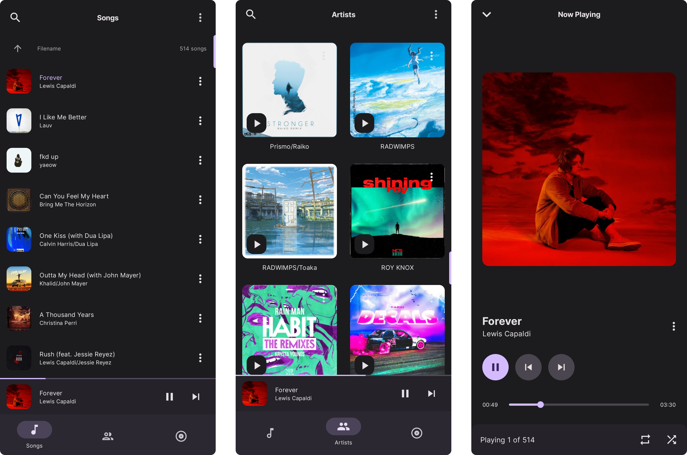

    

    
    

<h1 align="center">Symphony</h1>

🎵 Groovify & Symphonize with Symphony!

Symphony is a lightweight, elegant music player to enhance your offline playblack.

    
    
    
    
    

 

    

## What & How?

Why was this created? As I was getting into offline music, most of the popular good-looking music players supported filename based sorting. So why didn't I fork and add it? I felt like trying out Kotlin and Compose, thus made my own.

## Contributing

Any kind of contribution including creating issues or making pull requests is welcomed. Make sure to keep it pointful.

## License

[AGPL-3.0](./LICENSE)
