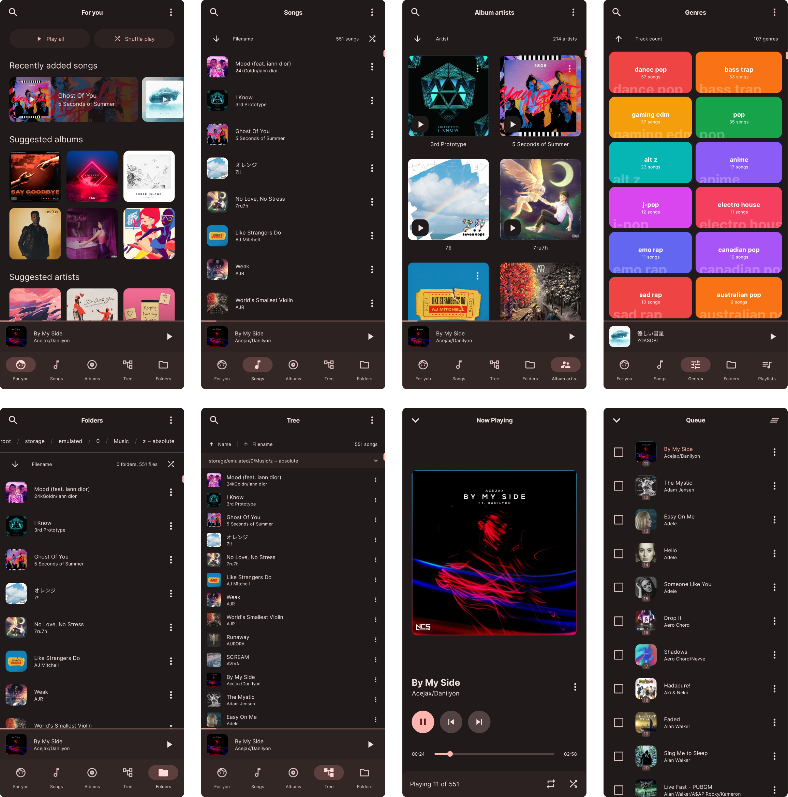

    

    
    

<h1 align="center">Symphony</h1>

🎵 Lightweight, elegant music player that enhances your offline music experience. Supports Android 9 and later.

    <a href="https://github.com/zyrouge/symphony/releases/latest">Download (latest)</a> |
    <a href="https://github.com/zyrouge/symphony/releases">View all releases</a> |
    <a href="https://apt.izzysoft.de/fdroid/index/apk/io.github.zyrouge.symphony">IzzyOnDroid</a> |
    <a href="https://f-droid.org/en/packages/io.github.zyrouge.symphony/">F-Droid</a> |
    <a href="https://play.google.com/store/apps/details?id=io.github.zyrouge.symphony">Play Store</a>

    
    
    
    
    
    
    
    
    
    
    

 

    

## Why?

Why was this created? As I was getting into offline music, most of the popular good-looking music players did not support filename/path based sorting, which is what I really needed to keep my music organized. So I must have forked them and added it right? I could have done that but, I felt like trying out Kotlin and Compose, so I ended up making my own.

## Links

-   [Wiki](https://github.com/zyrouge/symphony/wiki)
-   [Discord](https://discord.gg/5k9Hdq7ycm)
-   [Reddit](https://reddit.com/r/symphony_app)
-   [Github Sponsors](https://github.com/sponsors/zyrouge)
-   [Patreon](https://patreon.com/zyrouge)

## Contributing

Before contributing, please read the [Developer Guide](https://github.com/zyrouge/symphony/wiki/Developer-Guide).

Any kind of contribution including creating issues or making pull requests is welcomed. Make sure to keep it pointful. Donations through [GitHub Sponsors](https://github.com/sponsors/zyrouge) or [Patreon](https://patreon.com/zyrouge) helps me to stay motivated to keep working on this project.

## License

[AGPL-3.0](./LICENSE)
